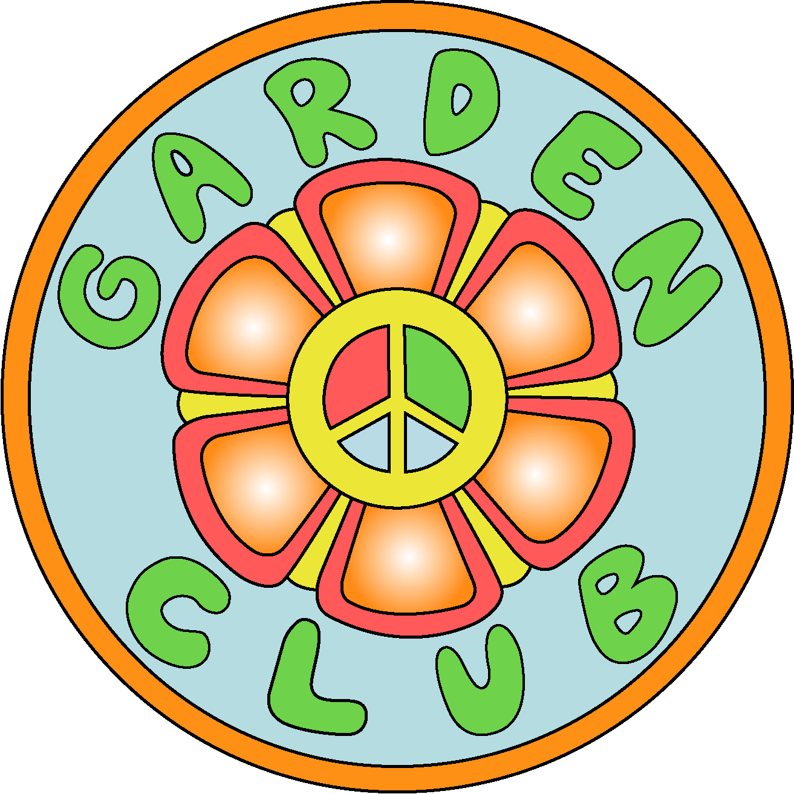

<!DOCTYPE HTML>
<html>
<head>
<meta charset=”UTF-8”>
<!-- THE TITLE WILL APPEAR IN THE BROWSER WINDOW OR TAB -->
<title>The Garden Club</title>

<link rel="stylesheet" type="text/css" href="styles-contact.css"
<link rel="preconnect" href="https://fonts.gstatic.com">
<link href="https://fonts.googleapis.com/css2?family=Kavoon&display=swap" rel="stylesheet">
</head>
<body>
    <nav>
        <ul>
            <li><a href="https://crowdfund.calpoly.edu/project/17431"> Donate</a></li>
            <li><a href="mailto:cbaile15@calpoly.edu"> Email Us!</a></li>
            <li><a href="images/Bailey_FoCo3.pdf"> FoCo Brochure</a></li>
        </ul>
     </nav> 
    

    

    

        
        <h1>Gardening a Better Tommorow!</h1>
        <h2>Join Us in Our Journey Toward Sustainability!</h2>
        <h3>Cal Poly San Luis Obispo, CA 93407</h3>

    
 <!--end of center div-->
</body>
</html>
html, body, div, span, applet, object, iframe,
h1, h2, h3, h4, h5, h6, p, blockquote, pre,
a, abbr, acronym, address, big, cite, code,
del, dfn, em, img, ins, kbd, q, s, samp,
small, strike, strong, sub, sup, tt, var,
b, u, i, center,
dl, dt, dd, ol, ul, li,
fieldset, form, label, legend,
table, caption, tbody, tfoot, thead, tr, th, td,
article, aside, canvas, details, embed, 
figure, figcaption, footer, header, hgroup, 
menu, nav, output, ruby, section, summary,
time, mark, audio, video {
	margin: 0;
	padding: 0;
	border: 0;
	font-size: 100%;
	font: inherit;
	vertical-align: baseline;
}
/* HTML5 display-role reset for older browsers */
article, aside, details, figcaption, figure, 
footer, header, hgroup, menu, nav, section {
	display: block;
}
body {
	line-height: 1;
}
ol, ul {
	list-style: none;
}
blockquote, q {
	quotes: none;
}
blockquote:before, blockquote:after,
q:before, q:after {
	content: '';
	content: none;
}
table {
	border-collapse: collapse;
	border-spacing: 0;
}

/* ---------- This is the beginning of my 377 FoCo Web Page Project ------------ */

html, body {
  height: 100%;
  width: 100%;
  padding: 0;
  margin: 0;
	background-image: url("images/background.jpg");
	background-repeat: no-repeat;
	background-position: center;
	background-size: cover;
	background-attachment: fixed;
}

.center {
	width: 650px;
	padding: 2%;
    margin: 100px auto;
 	background: 
	text-align "center";
	border: none;
}
   
#logo {
	margin-bottom: -5px;
}

h1 {
	font-family: 'Kavoon';
	font-size: 3.5em;
    margin: 10px;
	color: rgb(255, 145, 0);
	background-color: rgba(255, 255, 255, 0.849);
	text-align: center;
}

h2 {
	font-family: 'Kavoon';
	font-size: 2em;
    line-height: 1.4;
	color: rgb(255, 145, 0);
	background-color: rgba(255, 255, 255, 0.849);
	margin: 10px;
	text-align: center;
}

h3 {
	font-family: 'Kavoon';
	font-size: 1.5em;
    line-height: 1.4;
	color: rgb(255, 145, 0);
	background-color: rgba(255, 255, 255, 0.836);
	margin: 10px;
	text-align: center;
}

p {
	font-family: 'Kavoon';
	font-size: 1.2em;
    line-height: 1.6;
    color: #fff;
}

* {
	margin: 0;
	padding: 0;
  }
   
  nav {
	margin: 25px;
  }
   
  ul {
	overflow: auto;
	list-style-type: none;
  }
   
  li {
	height: 25px;
	float: right;
	margin-right: 0px;
	border-right: 1px solid #aaa;
	padding: 20px;
	vertical-align: text-top;
	position: top;
  }
   
  li a {
	text-decoration: none;
	color: rgb(255, 145, 0);
	font: 25px/1 'Kavoon';
	text-transform: uppercase;
	background-color: rgba(255, 255, 255, 0.842);
  } 
